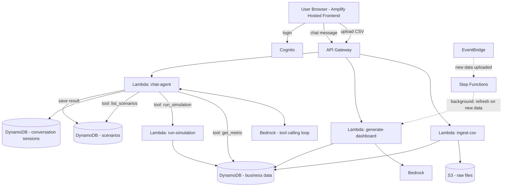

> **⚠️ This document describes the original AWS architecture and is being rewritten.**
>
> The project no longer uses AWS. Cognito, API Gateway, Lambda, DynamoDB, S3,
> Bedrock, EventBridge and Step Functions have been replaced by a single
> FastAPI application, PostgreSQL, local filesystem uploads, and a
> deterministic intent classifier (with a fine-tuned model planned).
>
> **Sections 2, 2a, 4, 8 and 10 below are out of date.** What is accurate:
> Section 1 (user flow), Section 3's module *contracts*, Section 7 (demo
> script) and Section 9 (definition of done, minus "deployed to AWS").
>
> For the architecture as built, read [`../backend/README.md`](../backend/README.md).

---

# Business Dashboard + What-If Simulator — Implementation Plan

**Goal:** A business owner uploads their sales/inventory/cost data, gets an auto-generated dashboard tailored to their business, and can ask "what if" questions (price changes, make-vs-buy decisions, etc.) to see a visual, plain-English projection of the impact — all deployed live on AWS with a shareable URL.

This is a college major project built to a production-minded standard. This document is the shared source of truth: everyone should be able to look at it and know what they're building, what their module receives, and what it hands off.

**Planning stance:** the *foundation* (tenancy/auth, module contracts, data model, simulation transparency) is fixed. Everything else is intentionally left open — see **Section 10: Open Decisions**. This plan is an initial draft and is expected to change.

---

## 1. End-to-End User Flow

1. User signs in (Cognito).
2. User uploads a CSV of sales/inventory/cost data (directly to S3 via a presigned URL).
3. System maps the CSV's columns to the internal schema, then parses and stores the data.
4. System auto-generates a dashboard: KPIs, charts, trends, anomalies — tailored to what's actually in their data.
5. User opens a chat panel next to the dashboard and asks questions in plain language — either **insight questions** ("why did my margin drop in March?") or **what-if scenarios** ("what if I raise Product X's price by 10%?", "what if I make packaging in-house instead of outsourcing?"). Both go through the same chat interface.
6. A Bedrock agent decides, turn by turn, which tool to use: look up real metrics, run a simulation, or pull up past scenarios. If a what-if is missing key numbers, the agent just asks for them in the same conversation.
7. For what-if questions, the simulation runs against the business's real historical data using transparent math (not AI-guessed numbers); the agent then explains the result in plain language.
8. User sees a before/after visual (chart) alongside the chat explanation, and can save the scenario for later comparison.
9. Entire app is reachable at a live URL, with each business owner's data kept private to their account.

---

## 2. Architecture Overview



**AWS services used and why:**
| Service | Role |
|---|---|
| Amplify Hosting | Frontend deploy, gives us the live URL |
| API Gateway | Request routing into Lambdas |
| Lambda | All backend logic, scales to zero |
| DynamoDB | Business data, scenario history, conversation sessions, user data |
| S3 | Raw uploaded files |
| Bedrock | Dashboard KPI generation, and the chat agent's reasoning + tool calling |
| Step Functions | Orchestrates the background dashboard-refresh flow when new data is uploaded |
| EventBridge | Triggers the refresh flow on new data upload |
| Cognito | Per-business login, keeps data private |

**Why the chat agent replaces the old parse→simulate→narrate pipeline:** instead of a rigid multi-Lambda chain, a single `chat-agent` Lambda runs a loop with Bedrock: send the conversation so far → if Bedrock requests a tool call, execute it (query DynamoDB, or call `run-simulation`) → feed the result back to Bedrock → repeat until Bedrock returns a final text answer. This is simpler to build than a state machine for a chat turn (lower latency, no clarification-loop plumbing needed — the agent just asks in-conversation), and it naturally handles both insight questions and what-if scenarios through one interface. Step Functions still earns its place, just for the heavier background job (re-generating the dashboard after new data lands) rather than the turn-by-turn chat.

---

## 2a. Foundation Rules (fixed)

1. **Tenancy comes from the token, never the request.** `business_id` is derived server-side from the verified Cognito JWT (via the `Users` table or a custom claim). It is **never** accepted from the client body/query and **never** part of any tool schema the model sees — the `chat-agent` injects it into every tool call itself. The `business_id` fields in the contracts below describe the *internal* Lambda-to-Lambda shape only.
2. **Cognito authorizer is on the API from day one** (one test account is fine). It is not a late add-on.
3. **Simulations are transparent.** Every simulation result reports the method used, its assumptions, and a confidence level. The agent must surface these in its reply.
4. **Numbers come from code, not the LLM.** Bedrock chooses *what* to show and explains results; all values are computed deterministically.

---

## 3. Modules — Contracts

Each module should be built and testable independently. Below is the input/output contract for each — build against these contracts so nobody blocks anybody else.

### Module A — Data Ingestion (`ingest-csv`)
**Trigger:** S3 `ObjectCreated` event. The client first calls an API endpoint that returns a **presigned upload URL** (avoids API Gateway's 10 MB payload limit); the presigned key is prefixed with the caller's `business_id`.
**Column mapping:** CSVs won't match our schema. Ingestion maps source columns to the internal schema (heuristics first, optionally a Bedrock-suggested mapping the user can confirm), then validates types/dates and reports rejected rows rather than failing the whole file.
**Extra columns** the user has (e.g. store, channel, category) are preserved as optional attributes.
**Output (internal record schema):**
```json
{
  "business_id": "string",
  "records": [
    { "date": "YYYY-MM-DD", "product": "string", "units_sold": 0, "unit_price": 0.0, "unit_cost": 0.0 }
  ]
}
```
**Owns:** S3 bucket for raw files, this Lambda, the record schema, the column-mapping step.
**Note:** if a product can have several rows per day (stores/channels), the sort key must include the extra dimension or rows will overwrite each other — see Section 4.
**Test in isolation:** Upload a sample CSV, confirm structured records land correctly in DynamoDB. No dependency on any other module.

---

### Module B — Dashboard Generation (`generate-dashboard`)
**Input:** `business_id` (reads structured records from DynamoDB)
**Output:**
```json
{
  "kpis": [ { "label": "string", "value": 0, "trend": "up|down|flat" } ],
  "charts": [ { "type": "line|bar", "title": "string", "x": [...], "series": [...] } ],
  "anomalies": [ "string" ]
}
```
**Owns:** This Lambda, the Bedrock prompt for KPI/chart selection.
**Rule:** Bedrock picks *which* KPIs/charts to show (validated against a schema); the values are computed in code. Caching strategy (generate on upload vs. on request) is an open decision.
**Test in isolation:** Feed it hand-crafted sample records directly (skip Module A), confirm sensible KPIs come back.

---

### Module C — Chat Agent (`chat-agent`)
**Input** (`business_id` is resolved from the JWT, not sent by the client):
```json
{
  "session_id": "string",
  "message": "raw natural language text"
}
```
**Output:**
```json
{
  "reply": "plain English text shown in chat",
  "chart": { "type": "line|bar", "metric": "revenue|margin|profit", "x": [...], "baseline_y": [...], "projected_y": [...] },
  "assumptions": [ "string" ],
  "scenario_saved_id": "string or null"
}
```
**Transport is an open decision** (single request/response vs. streaming vs. async submit + poll) because API Gateway times out at 29 s and a multi-tool Bedrock loop can exceed that. Keep the *payload shapes* above stable regardless of transport. A session must be verified to belong to the caller's business before its history is loaded.
**Behavior:** Runs a tool-calling loop against Bedrock. Loads recent turn history from the `ConversationSessions` table, sends it plus the new message to Bedrock with the three tools below defined. If Bedrock requests a tool call, this Lambda executes it and feeds the result back to Bedrock; repeats until Bedrock returns final text. Saves the updated turn history after each exchange.

**Tools available to the agent:**

> In all tool schemas below, `business_id` is injected by the Lambda and is **not** exposed to the model.

**`get_metric`** — for insight questions about existing data
```json
// tool input
{ "business_id": "string", "metric": "revenue|margin|units_sold|cost", "product": "string or null", "date_range": { "from": "YYYY-MM-DD", "to": "YYYY-MM-DD" } }
// tool output
{ "values": [ { "date": "string", "value": 0 } ], "summary_stats": { "min": 0, "max": 0, "avg": 0 } }
```

**`run_simulation`** — for what-if scenarios (calls Module D internally)
```json
// tool input
{ "business_id": "string", "scenario_type": "price_change|cost_change|make_vs_buy", "params": { "...": "..." } }
// tool output — see Module D's output contract below
```
If required params are missing, the agent simply asks the user for them in its next reply — no separate "missing_fields" handling needed, Bedrock handles this conversationally.

**`list_scenarios`** — for reviewing/comparing past what-ifs
```json
// tool input
{ "business_id": "string", "limit": 5 }
// tool output
{ "scenarios": [ { "scenario_id": "string", "question": "string", "summary": "string", "created_at": "string" } ] }
```

**Owns:** This Lambda, the Bedrock system prompt + tool definitions, the agent loop logic.
**Test in isolation:** Send it hardcoded sample messages (both insight and what-if types) with a mocked DynamoDB/simulation layer, confirm it picks the right tool and produces a sensible reply. No dependency on the frontend.

---

### Module D — Simulation Engine (`run-simulation`)
**Input:**
```json
{ "business_id": "string", "scenario_type": "string", "params": { "...": "..." } }
```
**Output:**
```json
{
  "baseline": { "revenue": 0, "margin": 0, "profit": 0 },
  "projected": { "revenue": 0, "margin": 0, "profit": 0 },
  "series": { "metric": "revenue|margin|profit", "x": [...], "baseline_y": [...], "projected_y": [...] },
  "method": "string (e.g. 'elasticity_from_history', 'default_elasticity', 'user_supplied', 'none')",
  "assumptions": [ "string" ],
  "confidence": "high|medium|low"
}
```
**Owns:** This Lambda. **Plain Python/pandas math only — no AI here.** Keep this deterministic and unit-testable; it's the module you should be able to explain in one sentence per formula.

**Demand-response strategy (price changes):** the engine picks the best available method for the data it has, in order, and reports which one it used:
1. *Elasticity estimated from history* — if the product has enough price variation and history (thresholds TBD).
2. *Default/category elasticity* — a stated assumption when history is insufficient (low confidence).
3. *User-supplied elasticity* — if the user gives one (the agent may ask).
The chosen method, its assumptions, and confidence must be returned in the output and repeated to the user by the agent. Method selection lives in one pluggable function so new strategies can be added later.

**Projection semantics** (historical replay vs. forward forecast) are an open decision — see Section 10. The first version can replay the historical period with the change applied.
**Test in isolation:** Feed it hand-crafted scenario objects, verify the math by hand. No dependency on Modules A, B, or C.

---

### Module E — *(retired)*
Narration is now handled directly by the chat agent's own reply (Module C) — Bedrock explains the simulation result as part of its normal conversational turn, so a separate narration Lambda isn't needed.

---

### Module F — Background Orchestration (Step Functions: `dashboard-refresh`)
Triggered by EventBridge when new data is uploaded. Re-runs Module B to regenerate the dashboard, and can be extended later (e.g. notify the user, re-check saved scenarios against new data).
**Owns:** The state machine definition only — no new business logic.
**Depends on:** Module B working. Build this after the core chat-agent loop (C+D) works — it's a nice-to-have, not core to the demo.
**Fallback if short on time:** Skip entirely; just re-call Module B directly after upload. You lose one "plumbing" checkbox but the demo still works fine.

---

### Module G — Frontend (Amplify app)
**Screens:** Login, Upload, Dashboard (with a chat panel alongside it for both insight questions and what-ifs), Scenario history.
**Owns:** All UI. Should be built from hour one against **mocked JSON responses matching the contracts above** — do not wait for backend modules to be finished.

---

### Module H — Auth & Persistence
**Owns:** Cognito user pool + API authorizer, DynamoDB tables (`BusinessData`, `Scenarios`, `Users`, `ConversationSessions`).
The authorizer and token-derived `business_id` (Foundation Rule 1) go in with the first API endpoint, using a single test account. Sign-up flow, user management UI and polish come later.

---

## 4. DynamoDB Table Sketch

**`BusinessData`**
| PK | SK | Attributes |
|---|---|---|
| `business_id` | `record#<date>#<product>[#<dimension>]` | units_sold, unit_price, unit_cost, optional extras (store, channel, ...) |

The optional `<dimension>` suffix prevents overwrites when several rows share a date and product. Item size limit (400 KB) and batch-write throttling apply to large CSVs — ingestion must use batched writes with retry.

**`Scenarios`**
| PK | SK | Attributes |
|---|---|---|
| `business_id` | `scenario#<timestamp>` | question, scenario_type, params, baseline, projected, summary |

**`Users`**
| PK | Attributes |
|---|---|
| `user_id` (Cognito sub) | business_id, email |

**`ConversationSessions`**
| PK | SK | Attributes |
|---|---|---|
| `session_id` | `turn#<timestamp>` | business_id (owner), role (`user`/`assistant`), content, tool_calls (if any), ttl |

Session ownership is checked against the caller's `business_id` on every load. `ttl` expires old sessions; only the last N turns are sent to the model.

---

## 5. Build Order (priority, not strict calendar)

0. **Foundation** — storage stack (tables/S3), Cognito + authorizer, shared `models.py`, sample-data generator.
1. **A + B** — real dashboard from real data. Derisks the core value proposition first.
2. **G (mocked)** — frontend in parallel from day one, against fake API responses matching the contracts above.
3. **D** — simulation math and demand-method selection. Most provably-correct module, easiest to unit test alone.
4. **C** — the chat agent wired up with all three tools (`get_metric`, `run_simulation`, `list_scenarios`), using D and DynamoDB.
5. **F** — background dashboard-refresh orchestration, once B works. Lowest priority — may be replaced by a simple async invoke.
6. **Polish** — scenario history, multi-metric and multi-scenario comparison views, chart animations, rehearse the demo script.

---

## 6. Suggested Parallel Tracks (if splitting into sub-teams)

- **Track 1 (Data track):** Foundation + Modules A + B + H (DynamoDB/Cognito) + F
- **Track 2 (Agent track):** Modules C + D
- **Track 3 (Frontend track):** Module G, building against contracts from day one

---

## 7. Demo Script (target: under 3 minutes)

1. Upload a seeded/sample sales CSV → dashboard appears with tailored KPIs. *(~20s)*
2. Ask an insight question in chat ("why did my margin drop in March?") → agent pulls real data and explains it. *(~15s)*
3. Ask a price-change what-if in the same chat → chart updates live, agent explains the projection. *(~30s)*
4. Ask a make-vs-buy what-if → agent asks one clarifying question in-chat, you answer, chart updates with breakeven reasoning against real historical volume. *(~40s)*
5. Show saved scenario history / comparison view. *(~15s)*

---

## 8. Folder Structure

Repo is a single monorepo, split by concern so each module/track can be worked on without stepping on others:

```
plutusai/
├── README.md
├── docs/
│   └── implementation-plan.md          # this document
│
├── frontend/                           # Module G — Amplify-hosted React app
│   ├── package.json
│   └── src/
│       ├── App.jsx
│       ├── api/client.js               # thin wrapper around API Gateway, mock until backend ready
│       ├── auth/CognitoConfig.js       # Module H
│       └── components/
│           ├── Upload/UploadForm.jsx
│           ├── Dashboard/
│           │   ├── Dashboard.jsx       # hosts ChatPanel alongside charts
│           │   ├── KpiCard.jsx
│           │   └── ChartPanel.jsx
│           ├── Chat/
│           │   ├── ChatPanel.jsx       # talks to chat-agent (Module C)
│           │   └── ChatMessage.jsx
│           └── ScenarioHistory/ScenarioHistory.jsx
│
├── backend/
│   ├── shared/                         # imported by every Lambda — keep thin
│   │   ├── dynamo_client.py            # table read/write helpers
│   │   ├── bedrock_client.py           # model invocation helper
│   │   └── models.py                   # shared schema/type definitions
│   └── lambdas/
│       ├── ingest_csv/                 # Module A
│       ├── generate_dashboard/         # Module B
│       ├── chat_agent/                 # Module C — handler.py + tools.py (get_metric, run_simulation, list_scenarios)
│       ├── run_simulation/             # Module D — plain Python/pandas math, no AI
│       └── dashboard_refresh_trigger/  # Module F — lowest priority, safe to skip
│           (each Lambda folder: handler.py, requirements.txt)
│
├── infra/                              # AWS CDK app — every AWS resource as code
│   ├── app.py
│   └── stacks/
│       ├── storage_stack.py            # S3, DynamoDB tables
│       ├── api_stack.py                # API Gateway, Lambdas, permissions
│       ├── auth_stack.py               # Cognito (Module H)
│       └── orchestration_stack.py      # EventBridge, Step Functions (Module F)
│
├── tests/                              # per-module tests (run_simulation first — pure math)
│   ├── run_simulation/
│   └── ingest_csv/
│
└── scripts/
    ├── seed_sample_data.py             # generates consistent synthetic test data (real datasets to be sourced later)
    └── deploy.sh
```

**Why it's laid out this way:**
- `frontend/`, `backend/`, `infra/` are separated so the frontend, agent, and infra tracks (Section 6) can move independently — nobody needs another track's code to open their own folder and start.
- Every Lambda gets its own folder under `backend/lambdas/` with its own `requirements.txt`, so modules can be deployed and versioned independently rather than sharing one giant dependency list.
- `backend/shared/` exists specifically to avoid duplicating DynamoDB/Bedrock boilerplate across Lambdas — but keep it to thin helpers only; business logic stays in each module's own `handler.py`.
- `infra/stacks/` mirrors the AWS-service groupings from Section 2, so whoever owns a given service only has one file to touch.
- Each Lambda's `handler.py` is stubbed with its contract (input/output shape, what it owns, how to test it in isolation) copied from Section 3, so opening the file alone tells you what to build — no need to cross-reference this doc while coding.

The skeleton described above already exists in this repo (stub files only).

---

## 9. Definition of Done (MVP)

- [ ] CSV upload → structured data stored
- [ ] Dashboard auto-generates from real data
- [ ] Chat agent correctly routes between insight questions and what-if scenarios
- [ ] At least 2 working what-if scenario types (price change, make-vs-buy)
- [ ] Agent asks clarifying questions in-chat when a what-if is missing key numbers
- [ ] Before/after visual renders correctly alongside chat replies
- [ ] Conversation history persists within a session
- [ ] Login works, data is private per business (`business_id` derived from the token only)
- [ ] Simulation results show method, assumptions and confidence
- [ ] App is deployed and reachable via a public URL
- [ ] Demo script rehearsed end-to-end at least twice

---

## 10. Open Decisions (deliberately deferred)

Decide these when the relevant module starts, not now.

| Decision | Options / notes | Decide by |
|---|---|---|
| Chat transport | Single request/response, Lambda function URL streaming, WebSocket API, or async submit + poll. Driven by the 29 s API Gateway limit. | Before Module C |
| Bedrock model + region | Deploying in India (`ap-south-1`); Anthropic model availability there may be limited — check the console once access is granted, and consider APAC cross-region inference profiles. Keep model ID in config, not code. | When Bedrock access is granted |
| Shared code packaging | Lambda Layer vs. bundling `backend/shared` per function; use the AWS-provided SDK-for-pandas layer instead of pip-bundling pandas. | Before first CDK deploy of Lambdas |
| Dashboard caching | Generate on upload (and store) vs. on request. | Module B |
| Projection semantics | Historical replay with the change applied vs. forward forecast; horizon length. | Module D |
| Elasticity thresholds | How much price variation/history counts as "enough" to estimate from data; default elasticity values. | Module D |
| Column mapping UX | Heuristics only vs. Bedrock-suggested mapping with user confirmation. | Module A |
| Comparison views | Multi-metric and multi-scenario charts. | Polish phase |
| Background refresh | Step Functions + EventBridge vs. a plain async Lambda invoke. | After Module B |
| Data source | Synthetic generator first; real public datasets to be sourced. | Foundation / Module A |
